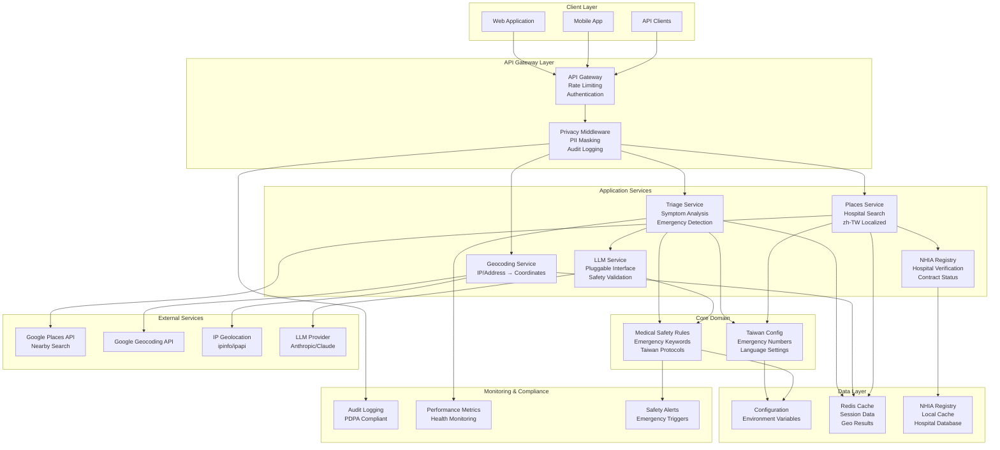

# Taiwan Medical AI Agent - High-Level System Architecture

## Architecture Overview

The Taiwan Medical AI Agent is designed as a scalable, secure, and Taiwan-localized medical assistant system built on FastAPI with strict safety protocols and PDPA compliance.

## Core Architectural Principles

### 1. Safety-First Design
- Emergency protocols take absolute priority
- All medical outputs include disclaimers and emergency contact information
- Fail-safe defaults for medical advice

### 2. Taiwan Localization
- Language: zh-TW (Traditional Chinese)
- Region: TW (Taiwan)
- Emergency numbers: 119, 110, 112, 113, 165
- Healthcare system: Taiwan National Health Insurance integration

### 3. Privacy & Compliance (PDPA)
- Minimal data collection
- PII masking and anonymization
- Audit logging without sensitive data
- User consent and data rights

### 4. Modular & Extensible
- Pluggable LLM interfaces
- Service-oriented architecture
- Clear separation of concerns
- Interface-driven design

## System Architecture Diagram



## Key Architectural Components

### 1. API Gateway Layer
- **Rate Limiting**: Prevent abuse and manage costs
- **Authentication**: API key validation
- **Request Routing**: Direct requests to appropriate services
- **CORS Handling**: Cross-origin request management

### 2. Privacy Middleware
- **PII Masking**: Remove/hash sensitive information
- **Audit Logging**: PDPA-compliant activity tracking
- **Data Minimization**: Collect only necessary data
- **Consent Management**: Track user permissions

### 3. Application Services
- **Triage Service**: Symptom analysis and emergency detection
- **Geocoding Service**: Location processing and validation
- **Places Service**: Hospital search with Taiwan localization
- **LLM Service**: AI-powered medical guidance with safety controls
- **NHIA Service**: Hospital verification against national registry

### 4. Medical Safety Layer
- **Emergency Detection**: Keyword-based critical symptom identification
- **Safety Rules**: Taiwan-specific medical protocols
- **Disclaimer Injection**: Mandatory medical disclaimers
- **Emergency Escalation**: Automatic 119/112 guidance

## Data Flow Patterns

### 1. Symptom Triage Flow
```
User Input → Privacy Mask → Emergency Check → Rule Analysis → LLM Enhancement → Safety Validation → Response + Disclaimer
```

### 2. Hospital Search Flow
```
Location Input → Geocoding → Places Search (zh-TW) → NHIA Verification → Distance Sorting → Localized Response
```

### 3. Emergency Protocol Flow
```
Critical Keywords → Immediate 119 Alert → Skip Normal Processing → Emergency Response + Hospital List
```

## Technology Stack

### Backend Framework
- **FastAPI**: High-performance, type-safe API framework
- **Python 3.11**: Latest stable Python with enhanced type hints
- **Pydantic**: Data validation and serialization
- **httpx**: Async HTTP client for external API calls

### External Integrations
- **Google Places API (New)**: Hospital search with zh-TW support
- **Google Geocoding API**: Address to coordinates conversion
- **IP Geolocation**: Automatic location detection
- **Anthropic Claude**: LLM for medical guidance

### Data & Caching
- **Redis**: Session data and API response caching
- **JSON/YAML**: Configuration and static data
- **CSV/JSON**: NHIA registry local cache

### Testing & Quality
- **pytest**: Test framework with async support
- **RESpx**: HTTP mocking for external API testing
- **httpx TestClient**: FastAPI integration testing
- **pytest-cov**: Code coverage reporting

## Security Architecture

### 1. Data Protection (PDPA Compliance)
- **Encryption at Rest**: AES-256 for sensitive data
- **Encryption in Transit**: TLS 1.3 for all communications
- **PII Anonymization**: Hash/mask personal information
- **Right to Deletion**: Support data removal requests

### 2. API Security
- **API Key Authentication**: Secure service access
- **Rate Limiting**: Prevent abuse and DoS attacks
- **Input Validation**: Strict request validation
- **Output Sanitization**: Safe response formatting

### 3. Medical Safety Controls
- **Emergency Override**: Critical symptoms bypass normal flow
- **Disclaimer Enforcement**: Mandatory medical disclaimers
- **LLM Output Validation**: Safety checks on AI responses
- **Audit Trail**: Complete activity logging (anonymized)

## Scalability Design

### 1. Horizontal Scaling
- **Stateless Services**: Enable multiple instance deployment
- **Load Balancing**: Distribute requests across instances
- **Connection Pooling**: Efficient database/cache connections
- **Async Processing**: Non-blocking I/O operations

### 2. Caching Strategy
- **API Response Caching**: Reduce external API calls
- **Geo Location Caching**: Store coordinate lookups
- **Configuration Caching**: In-memory config access
- **Session Caching**: Redis-backed user sessions

### 3. Performance Optimization
- **Response Compression**: Gzip/Brotli compression
- **Database Indexing**: Optimized query performance
- **Lazy Loading**: Load data only when needed
- **Connection Reuse**: Persistent HTTP connections

## Deployment Architecture

### 1. Containerization
- **Docker**: Application containerization
- **Multi-stage Builds**: Optimized image sizes
- **Health Checks**: Container health monitoring
- **Environment Configuration**: Docker Compose for local development

### 2. Cloud Deployment Options
- **Kubernetes**: Container orchestration
- **Docker Swarm**: Simpler container clustering
- **Cloud Run**: Serverless container platform
- **Traditional VPS**: Virtual private server deployment

### 3. Infrastructure Components
- **Load Balancer**: Traffic distribution
- **Redis Cluster**: Distributed caching
- **Monitoring Stack**: Prometheus + Grafana
- **Log Aggregation**: ELK Stack or similar

## Architecture Decision Records (ADRs)

### ADR-001: FastAPI Framework Selection
- **Decision**: Use FastAPI for backend API
- **Rationale**: Type safety, async support, automatic documentation
- **Alternatives**: Django REST, Flask
- **Status**: Accepted

### ADR-002: Google Places API for Hospital Search
- **Decision**: Use Google Places API (New) with zh-TW localization
- **Rationale**: Comprehensive hospital data, Taiwan localization support
- **Alternatives**: OpenStreetMap, local databases
- **Status**: Accepted

### ADR-003: Rule-Based + LLM Hybrid Approach
- **Decision**: Combine rule-based safety checks with optional LLM enhancement
- **Rationale**: Ensures safety while providing enhanced responses
- **Alternatives**: Pure rule-based, pure LLM
- **Status**: Accepted

### ADR-004: PDPA-First Design
- **Decision**: Build privacy protection into core architecture
- **Rationale**: Legal compliance and user trust
- **Alternatives**: Add privacy as afterthought
- **Status**: Accepted

## Next Steps

1. **Component Design**: Detailed service interface design
2. **API Contracts**: OpenAPI specification creation
3. **Data Models**: Pydantic model definitions
4. **Security Implementation**: Privacy middleware design
5. **Testing Strategy**: Test architecture and patterns
6. **Deployment Planning**: Infrastructure as code

## Architecture Validation

This architecture design addresses:
- ✅ Taiwan medical requirements and localization
- ✅ Safety-first medical guidance approach
- ✅ PDPA compliance and privacy protection
- ✅ Scalable and maintainable system design
- ✅ Comprehensive testing strategy
- ✅ Emergency protocol integration
- ✅ Modular LLM interface design
- ✅ Performance and reliability considerations